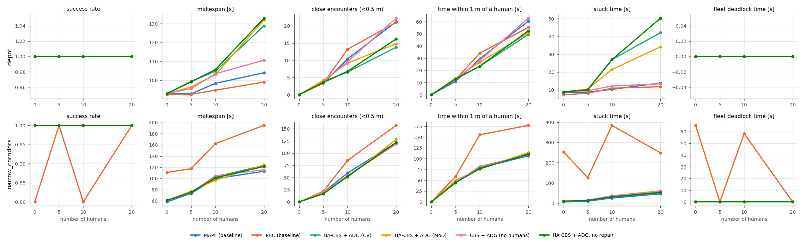

# Human-Aware, Uncertainty-Robust MAPF for UGV Fleets

Classical MAPF solvers such as CBS plan on discrete grids with ideal timing. Real robots
accelerate, slow down and get blocked by people, so planned solutions stop being valid
during execution (the core finding of REMROC, Heuer et al., ICRA 2024). This
repository closes that plan–execution gap on top of
[REMROC](https://github.com/boschresearch/remroc) in three ways:

1. **Probabilistic, human-risk-weighted CBS.** Predicted human occupancy enters CBS as
   soft, time-varying edge costs $1+\lambda\,P(\text{human in } v \text{ at } t)$. The
   solver is also k-robust, bounded-suboptimal (focal search) and supports
   reservations. It lives in C++ in the extended `remroc_mapf_solver` service, which
   now accepts a time-indexed cost map.
2. **A deadlock-free, delay-tolerant execution layer.** Plans are executed through an
   Action Dependency Graph, and local plan repair re-plans only the affected robots
   while the others keep their schedules as reservations.
3. **Theory**: proofs of optimality and bounded suboptimality, of the risk–optimality
   trade-off, of collision- and deadlock-freedom for any timing, and of completeness
   under bounded delays ([docs/THEORY.md](docs/THEORY.md)).

The new coordinator `coordinator_ha_cbs` (built from `coordinator_template.py`)
subscribes to the human positions from Gazebo, runs a predictor (constant velocity,
or a CLiFF-style map of dynamics blended with a learnt prior), and sends risk maps to
the solver. Worlds with 0/5/10/20 humans × 5 samples are generated for a new
narrow-corridor layout and for REMROC's warehouse (depot), each with 5 UGVs.

## Results at a glance

Results come from the grid-level simulator, which uses the same worlds, the same
coordinator code and the same metrics as the Gazebo pipeline. The Gazebo runs are
scripted but have **not** been executed yet. Details and caveats are in
[docs/EXPERIMENTS.md](docs/EXPERIMENTS.md).

* **No deadlocks, no collisions under delays.** With robot–robot avoidance disabled
  and heavy stalls injected, CBS+ADG succeeded in 10/10 episodes with no contact. The
  iterative-MAPF baseline succeeded in 3/10, with contact in 7/10. PBC deadlocked in
  the corridors.
* **Fewer close encounters with humans in open layouts.** In the warehouse with 10–20
  humans, encounters closer than 0.5 m fell by 31–38% against the same system without
  prediction and by 35–37% against the MAPF baseline. Makespan rose by 1–16% against
  the ablation (7–24% against the MAPF baseline). Where humans must share single-lane
  corridors, there was no measurable benefit.
* **Practical planning.** With dense risk maps, optimal CBS times out in 13 of 20
  five-robot instances. Focal search with w=1.1 solves all of them in ≤ 50 ms, within
  1.3% of the best objective found.
* **Prediction.** Tracking-based forecasts lose their value after about 2–3 steps
  (6–9 s). Blending them into a static prior learnt from training worlds gives the best
  forecasts at all horizons.



## Repository layout

```
src/                              colcon workspace (REMROC packages, vendored at a2159cb + changes)
  remroc/                         launch, experiments, worlds; coordinators incl. NEW coordinator_ha_cbs.py,
                                  human_pose_publisher.py, metrics_recorder.py
  remroc_mapf_solver/             MAPF service: original CBS + risk-aware CBS (time-indexed cost map)
  remroc_cbs_library/             NEW risk_cbs.hpp (header-only), risk_cbs_cli, C++ tests
  remroc_interfaces/              NEW RemrocRiskMap.msg, extended RemrocMapfsolver.srv
  remroc_world_generation/        NEW layouts.py, human_trajectories.py, generate_worlds.py
  remroc_robots/                  unchanged
  remroc_ha/                      NEW ROS-independent core:
    remroc_ha/risk_cbs.py           reference solver (cross-validated against C++)
    remroc_ha/prediction.py         tracker, CV + map-of-dynamics predictors, risk-map rasterisation
    remroc_ha/adg.py                Action Dependency Graph, earliest-start schedules
    remroc_ha/coordination.py       HumanAwareCoordinator (planning, ADG dispatch, local repair)
    remroc_ha/metrics.py            metric definitions used by simulator and ROS recorder
    remroc_ha/sim/                  grid-level simulator, baseline ports, experiment runner
    test/                           pytest suite
docs/THEORY.md                    model, theorems, proofs
docs/EXPERIMENTS.md               protocol, results, threats to validity
docs/UPSTREAM_CHANGES.md          every change made to upstream REMROC
results/                          simulator results (CSV, markdown tables, figures)
scripts/                          build_solver.sh, run_remroc_experiments.sh
```

## Quick start without ROS (any OS, Python ≥ 3.8, a C++17 compiler)

```bash
pip install numpy scipy pyyaml matplotlib pytest
scripts/build_solver.sh                  # optional: fast C++ solver; otherwise the Python solver is used
python -m pytest                         # 169 tests (solver cross-validation, ADG safety/liveness, ...)
build/test_risk_cbs                      # C++ unit tests
PYTHONPATH=src/remroc_ha python -m remroc_ha.sim.experiments --out results/sim --jobs 8
```

## REMROC / Gazebo (Ubuntu 22.04, ROS 2 Humble, Gazebo Fortress)

Install the REMROC prerequisites (see upstream: `ros-humble-ros-ign-gazebo`,
`ros-humble-ros-gz-bridge`, `ros-humble-navigation2`, `ros-humble-robot-localization`)
plus `python3-scipy python3-yaml libyaml-cpp-dev`. Then:

```bash
cd <this repo>
source /opt/ros/humble/setup.bash
colcon build && source install/setup.bash
# one experiment
ros2 launch remroc ignition.launch.py coordinator:=coordinator_ha_cbs world:=narrow_corridors \
    number_of_humans:=10 sample:=2
# baselines: coordinator:=coordinator_mapf | coordinator:=coordinator_pbc
# the whole grid (3 coordinators x 2 worlds x {0,5,10,20} humans x 5 samples)
scripts/run_remroc_experiments.sh && python3 -m remroc_ha.analysis ros results/remroc
```

Useful launch arguments: `risk_weight` (λ, default 4), `prediction:=cv|mod`,
`enable_repair`, `time_limit`, `human_source:=script|gazebo`, `use_depot_mod`.
The risk map sent to the solver is also published on `/ha_coordinator/risk_map`, and
coordinator events on `/coordinator/events`.

To regenerate the worlds (deterministic), or to generate them for other maps or human
counts:

```bash
ros2 run remroc_world_generation generate_worlds --map narrow_corridors depot \
    --humans 0 5 10 20 --samples 5 --remroc-dir src/remroc
```

## Solver service interface

`remroc_interfaces/srv/RemrocMapfsolver.srv` keeps the original fields, so
`coordinator_mapf.py` is unaffected. It adds:

* `risk_map`: `RemrocRiskMap` with `data[(t*height + y)*width + x]` = P(human in cell
  (x, y) at step t); layers beyond the horizon repeat the last one;
* `risk_weight`: λ;
* `reservations`: timed paths of robots that are not re-planned;
* `time_limit`, `robustness` (k), `suboptimality` (w).

The response adds `success`, `status`, `objective`, `sum_of_costs`, `makespan`,
`total_risk` (expected robot–human co-occupancies of the plan) and `solve_time`.

## Known limitations

These are discussed in [docs/THEORY.md §6](docs/THEORY.md) and
[docs/EXPERIMENTS.md](docs/EXPERIMENTS.md).

* The guarantees concern the coordination layer, on the grid abstraction.
* Humans are observed globally; scripted humans do not react to robots.
* Gazebo Fortress may not publish the server-side poses of scripted actors. The human
  pose publisher therefore replays the actor scripts from the world SDF against the
  bridged simulation clock by default.
* The pre-generated upstream worlds (`simple_*`, `depot_{0,10,20}_*`) are not vendored.

## License and credits

The REMROC packages are © their respective owners, Apache-2.0 (see `third_party/remroc`).
The CBS code derives from libMultiRobotPlanning (MIT). New code is Apache-2.0 per file
headers; the repository's own LICENSE file is MIT. If you use REMROC, please cite
Heuer et al., *Benchmarking Multi-robot coordination in realistic, unstructured
human-shared environments*, ICRA 2024.
