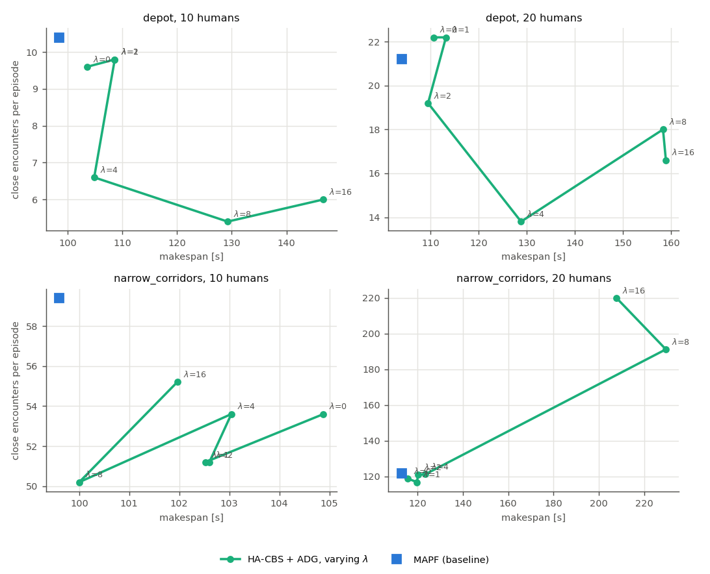

# Experiments

There are two evaluation paths, and they share the same inputs and metric definitions:

| | REMROC (Gazebo Fortress + nav2) | Grid-level simulator (`remroc_ha.sim`) |
|---|---|---|
| Purpose | reference evaluation from the proposal | fast, repeatable comparisons and ablations; stress tests |
| Worlds, robots, humans | `worlds/sdfs/<map>_<N>_<s>.sdf`, `params/exp_ha_<map>.yaml` | identical files (the human trajectories are the same waypoints the SDF actors follow) |
| Coordinators | `coordinator_mapf`, `coordinator_pbc` (upstream), `coordinator_ha_cbs` | ports of the two baselines; the *same* `HumanAwareCoordinator` class as the ROS node |
| Metrics | `metrics_recorder` → `remroc_ha.metrics.compute_metrics` | `remroc_ha.metrics.compute_metrics` |
| Status | ready to run (`scripts/run_remroc_experiments.sh`); **not run here** (no ROS/Gazebo on the development machine) | all results below |

**Every number in this document comes from the grid-level simulator. None of them are
Gazebo results.**

## Setup

* **Layouts.**
  * `narrow_corridors` (new, procedural): two rooms joined by two single-lane
    corridors, 7 cells long and 1.7 m wide (MAPF grid 19×9, 1.2 m cells).
  * `depot`: REMROC's warehouse world, with upstream's 25×12 MAPF grid of 1.16 m cells.
* **Robots.** Five SmallDeliveryRobots (`exp_ha_narrow_corridors.yaml`, with 3 robots
  crossing left→right and 2 right→left; `exp_ha_depot.yaml`, which is upstream's
  `exp_0_depot.yaml` plus its commented-out fifth robot, snapped to cell centroids).
* **Humans.** 0, 5, 10 or 20 per world, × 5 samples, generated by
  `remroc_world_generation.generate_worlds`. Each human walks 0.6–1.1 m/s along an A*
  path to a random goal and back, looping, with a random phase. In the corridor world
  half of the humans cross between the rooms. The map of dynamics is fitted on 4
  separate training worlds, never on the evaluation worlds.
* **Simulator** (`sim/robot.py`). It models the SmallDeliveryRobot limits (0.5 m/s,
  acceleration and deceleration limits, turning in place), a random speed factor of
  0.75–1.0 per command, random stalls (1/60 s⁻¹, 1–3 s), nav2's "remove passed goals",
  and a local safety layer that stops a robot when a human or robot is in front of it.
  Humans do not react to robots, as with Gazebo actors. Episodes last at most 400 s.
* **Coordinators.**
  * `mapf`: port of `coordinator_mapf.py`. Every 0.55 s it re-solves plain CBS from the
    robots' current cells and sends each path up to its first wait.
  * `pbc`: port of `coordinator_pbc.py`. Fixed global paths with critical sections, and
    precedence to the robot closer to the section.
  * `ha_cbs`: the proposed method. Risk-aware CBS (λ=4, k=1, w=1.1), constant-velocity
    prediction blended into the static prior (τ=10 s), ADG execution, and local repair.
  * `ha_cbs_mod`: the same with map-of-dynamics particle prediction.
  * Ablations: `adg_cbs` (no human awareness, λ=0) and `ha_cbs_norepair`.
* **Metrics** (`remroc_ha/metrics.py`):
  * success: all robots at their goals within the time limit, with no robot–robot
    contact;
  * makespan and sum of costs, in seconds of arrival time;
  * minimum human–robot distance;
  * time with any robot within 1 m of a human;
  * close encounters, counted as robot–human pairs coming closer than 0.5 m;
  * re-plans;
  * stuck time: standstill away from the goal lasting at least 2 s;
  * fleet deadlock time: all unfinished robots standing still for at least 5 s.

## Reproduce

```bash
scripts/build_solver.sh                                   # C++ solver CLI (optional; Python fallback exists)
export PYTHONPATH=src/remroc_ha:src/remroc_world_generation
python -m remroc_world_generation.generate_worlds --remroc-dir src/remroc   # already done, deterministic
python -m remroc_ha.sim.experiments --out results/sim --jobs 8               # main grid, 240 episodes, ~2 min
python -m remroc_ha.sim.experiments --out results/sim_lambda --worlds depot narrow_corridors \
       --humans 10 20 --coordinators ha_cbs mapf --risk-weights 0 1 2 4 8 16
python -m remroc_ha.sim.experiments --out results/sim_stress --humans 0 \
       --coordinators mapf pbc adg_cbs ha_cbs --stall-rate 0.1 --stall-duration 2 8 --no-robot-avoidance
python -m remroc_ha.sim.component_eval prediction      # results/prediction/brier.md
python -m remroc_ha.sim.component_eval planner         # results/planner/planner.md
python -m remroc_ha.analysis sim results/sim; python -m remroc_ha.analysis lambda results/sim_lambda
```

Gazebo (Ubuntu 22.04, ROS 2 Humble, Gazebo Fortress; see README):

```bash
scripts/run_remroc_experiments.sh             # 3 coordinators x 2 worlds x 4 densities x 5 samples
python3 -m remroc_ha.analysis ros results/remroc
```

## Results (grid-level simulator)

Full table: [`results/sim/summary.md`](../results/sim/summary.md). Per-episode data:
`results/sim/episodes.csv`. Figure: `results/sim/main.png`.


### 1. Deadlocks and delays: the execution layer

In the main grid (40 episodes per coordinator), every ADG-based variant succeeded in
40/40 episodes, with zero fleet-deadlock time and no robot–robot contact. PBC
deadlocked in 2 corridor episodes and succeeded in 38/40. The MAPF baseline also
succeeded in 40/40, but only because the simulator gives it an instantaneous solver
and a local layer that prevents robot–robot contact. The **stress test** removes the
second of these props. It turns off robot–robot avoidance in the local layer (safety
must come from coordination) and injects heavy delays: stalls of 2–8 s at 0.1 s⁻¹,
0 humans, 5 samples.

| world | coordinator | success | episodes with robot–robot contact | fleet deadlock time [s] | re-plans |
|---|---|---|---|---|---|
| depot | MAPF | 0.40 | 0.60 | 6.5 | 267 |
| depot | PBC | 1.00 | 0.00 | 2.5 | 0 |
| depot | **CBS+ADG** | **1.00** | **0.00** | 4.7 | 24 |
| narrow_corridors | MAPF | 0.20 | 0.80 | 2.8 | 202 |
| narrow_corridors | PBC | 0.80 | 0.00 | 53.1 | 0 |
| narrow_corridors | **CBS+ADG** | **1.00** | **0.00** | **0.0** | 22 |

This is Theorems 5 and 6 of [THEORY.md](THEORY.md) in action: the ADG keeps robots
apart for *any* timing and never deadlocks, whereas iterative MAPF assumes robots are
where the plan says they are. (The non-zero deadlock time of the ADG in the depot
consists of episodes where every waiting robot depends on a stalled robot; each ends
when the stall ends.)

Cost of this robustness without humans: makespan +5% (corridors, 60.9 s vs 58.1 s) and
±0% (depot, 93.0 s vs 93.0 s) relative to the MAPF baseline. It comes from 1-robust
plans and from waiting for dependencies. The ADG variants re-plan 1–21 times per
episode, against 109–207 global re-solves for the MAPF baseline.

### 2. Human awareness

Relative to the same system without prediction (`adg_cbs`) and to the MAPF baseline:

| world | humans | close encounters ha_cbs / adg_cbs / mapf | Δ vs adg_cbs | Δ vs mapf | makespan Δ vs adg_cbs |
|---|---|---|---|---|---|
| depot | 5 | 3.8 / 3.8 / 3.4 | ±0% | +12% | +4% |
| depot | 10 | 6.6 / 9.6 / 10.4 | **−31%** | **−37%** | +1% |
| depot | 20 | 13.8 / 22.2 / 21.2 | **−38%** | **−35%** | +16% |
| narrow_corridors | 5 | 17.0 / 18.6 / 19.6 | −9% | −13% | +2% |
| narrow_corridors | 10 | 53.6 / 53.6 / 59.4 | ±0% | −10% | −2% |
| narrow_corridors | 20 | 121.2 / 118.8 / 121.6 | +2% | ±0% | +7% |

Time within 1 m of a human falls in the same pattern (depot 20: 49.5 s vs 62.8 s vs
60.4 s).

* In the open warehouse with 10–20 humans, risk-aware planning avoids about a third of
  the close encounters. The price is 1–16% longer makespan against its own ablation, or
  7–24% against the MAPF baseline.
* In the corridor world there is **no measurable benefit** at 10–20 humans: both
  passages are regularly occupied, so there is no low-risk alternative to choose.
* The *minimum* human–robot distance is close to 0 for every method at ≥10 humans,
  because scripted humans walk into robots that stand still. It is reported, but it
  does not separate the methods.
* Map-of-dynamics prediction did not beat constant velocity at the system level, even
  though it is the better forecaster (next section).

**Risk–efficiency trade-off** (`results/sim_lambda`, figure `tradeoff.png`). In the depot,
λ=4 gave the best balance: 20 humans went from 22.2 to 13.8 encounters at +16%
makespan, and 10 humans from 9.6 to 6.6 at +1%. Larger λ costs much more time for
little further gain. The execution-level curve is only roughly monotone, because the
plan-level trade-off of Proposition 3 is filtered through imperfect prediction and
5 samples. In the saturated corridor world, λ ≥ 8 makes robots wait for gaps that
rarely open: at λ=16, 2 of 5 episodes with 20 humans exceed the 400 s limit. This
failure mode matters when choosing λ.



### 3. Local repair

With scripted humans that pass through robots, blockages are short, and the ADG alone
already waits them out. `ha_cbs` and `ha_cbs_norepair` therefore perform almost the
same (depot 20: 128.8 s vs 132.8 s makespan, 13.8 vs 16.2 encounters). Repairs trigger
1–15 times per episode on average, mostly because a robot was blocked; risk-triggered repairs are
usually rejected by the improvement hysteresis. The repair machinery is exercised and
validated (rejected repairs are counted in `stat_rejected_repairs`), but this simulator
cannot show its value. Humans who stop in a doorway or corridor, or nav2 recovery
behaviours in Gazebo, would.

### 4. Components

**Prediction quality** ([`results/prediction/brier.md`](../results/prediction/brier.md)):
the Brier score of per-cell occupancy per step ahead, where one step is 3 s. Beyond
2–3 steps, both tracking-based predictors approach the score of predicting nothing.
The static prior learnt from training worlds is the best long-horizon forecast. This
motivated blending prediction into the prior, with τ = 10 s chosen on held-out worlds.

| narrow_corridors | +0 s | +3 s | +6 s | +9 s | +15 s | +27 s |
|---|---|---|---|---|---|---|
| all-zero | 0.265 | 0.266 | 0.263 | 0.266 | 0.263 | 0.264 |
| CV | 0.013 | 0.137 | 0.187 | 0.214 | 0.239 | 0.257 |
| MoD particles | 0.007 | 0.130 | 0.170 | 0.189 | 0.201 | 0.200 |
| MoD + prior (blend) | 0.007 | **0.127** | **0.159** | **0.168** | **0.170** | **0.169** |

**Planner scalability** ([`results/planner/planner.md`](../results/planner/planner.md)):
the 5-robot experiment instances with realistic (dense) risk maps, λ=4, k=1, and a
10 s limit.

| world, humans | optimal CBS (w=1): solved, median time | focal w=1.1: solved, median time, gap to best |
|---|---|---|
| depot, 10 | 0/5, >10 s | 5/5, 0.036 s, 0.24% |
| depot, 20 | 0/5, >10 s | 5/5, 0.018 s, 0.00% |
| narrow_corridors, 10 | 3/5, 9.9 s | 5/5, 0.007 s, 1.27% |
| narrow_corridors, 20 | 4/5, 2.3 s | 5/5, 0.045 s, 1.18% |

Without humans every setting solves in under 1 ms. Soft, dense costs are what break
optimal CBS. Before focal search was added, this made the human-aware coordinator sit
idle for 20 s at the start of dense episodes.

## Threats to validity

* **Simulator ≠ Gazebo.** The robot model is simplified: no localisation error, no
  MPPI swerving, and robots stop instead of evading. The MAPF baseline gets an
  instantaneous solver and never hits its "invalid plan → stop" branch. Real REMROC
  runs may differ in both directions. The Gazebo pipeline is implemented but has not
  been executed here.
* **Scripted humans** do not react to robots, which makes the minimum-distance metric
  degenerate and limits what repair can show.
* **5 samples per cell.** Differences of a few percent are within noise. Per-episode
  data is provided for proper statistics.
* **Human observation** is global and near-perfect (5 cm noise).
* **Iterative development.** The prior blend, focal search and repair hysteresis were
  introduced after pilot runs showed a problem (documented in THEORY.md and above).
  τ was selected on held-out worlds. λ=4 and the other thresholds were set a priori and
  not tuned on the evaluation worlds.
